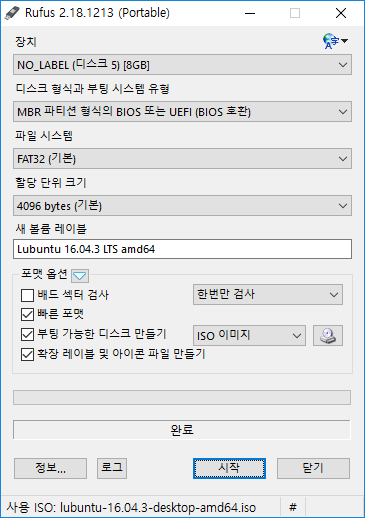
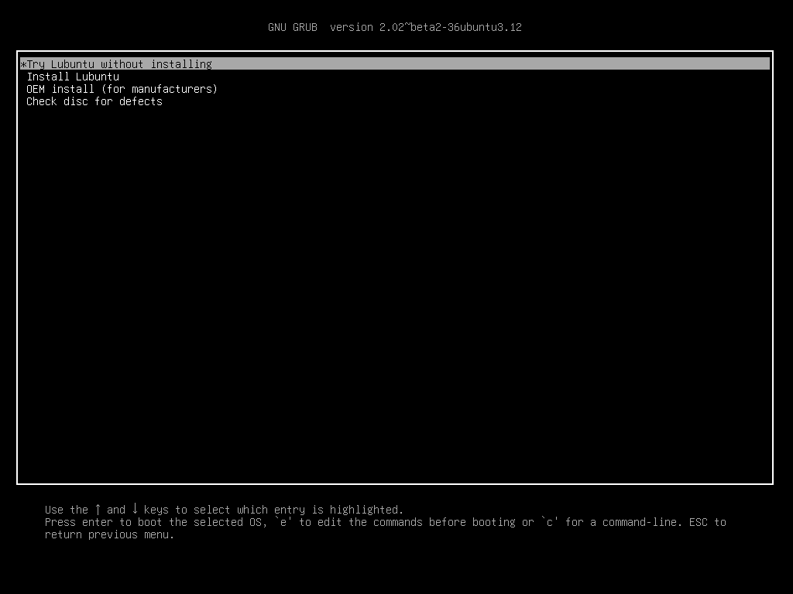
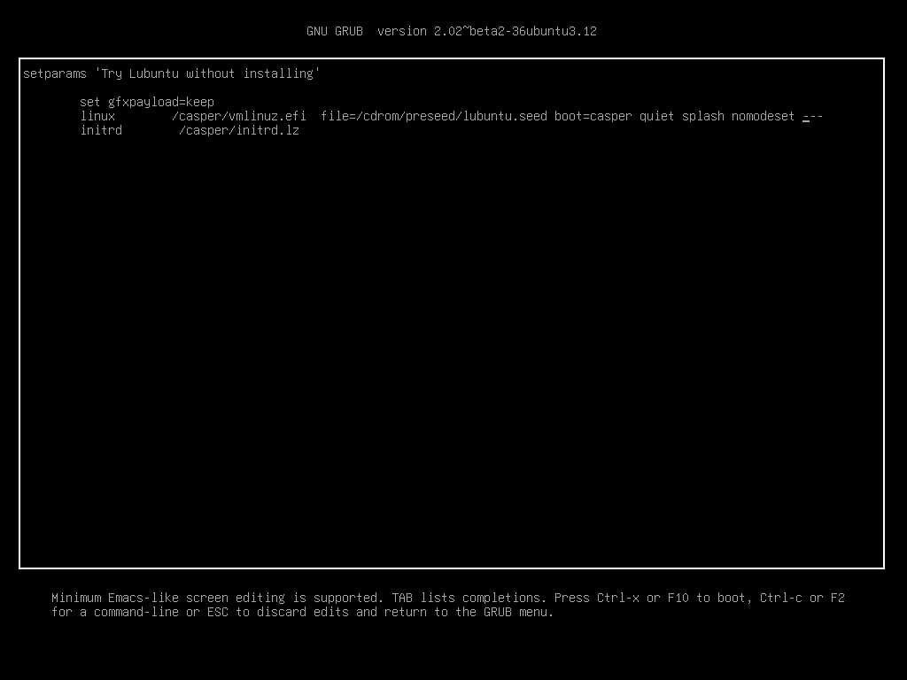
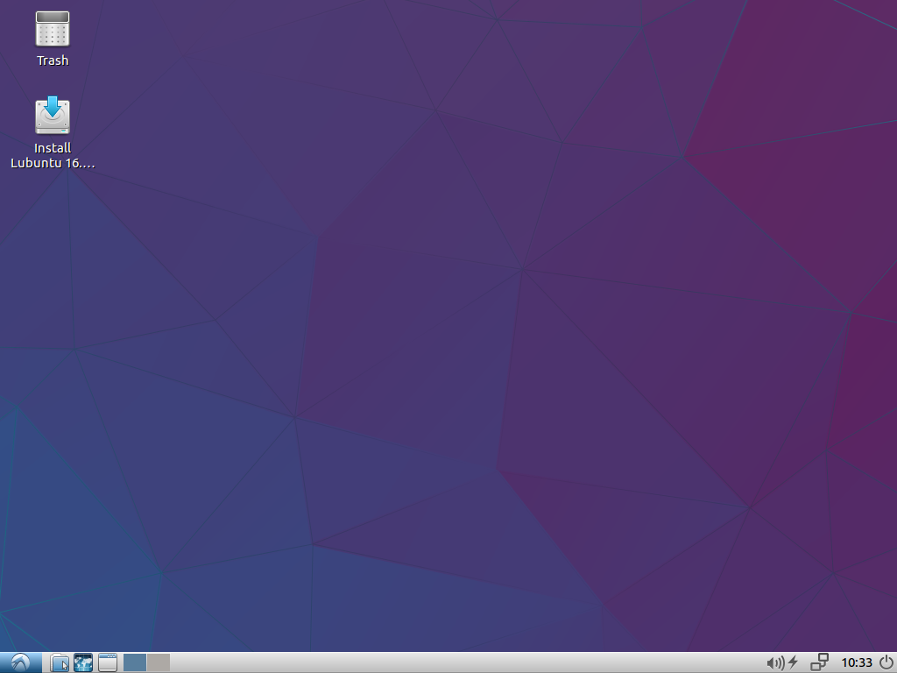
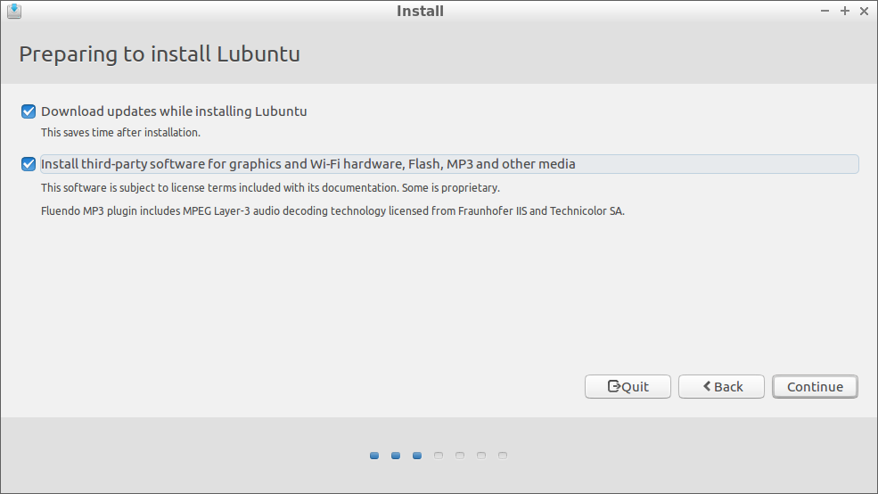
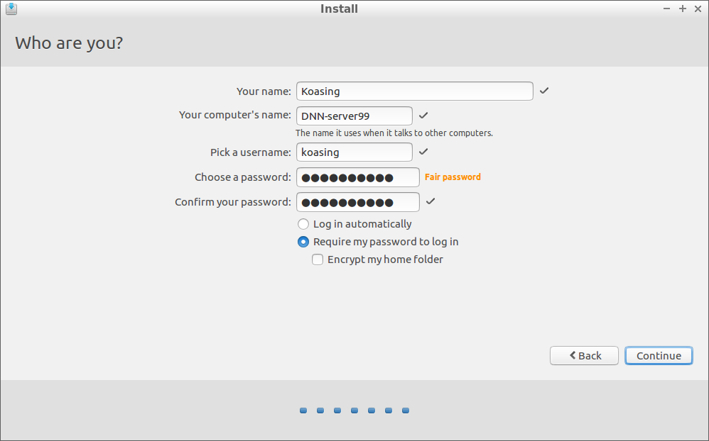
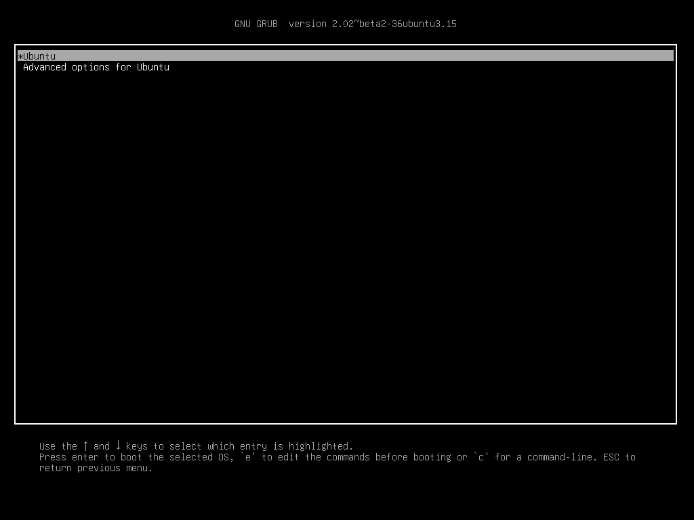
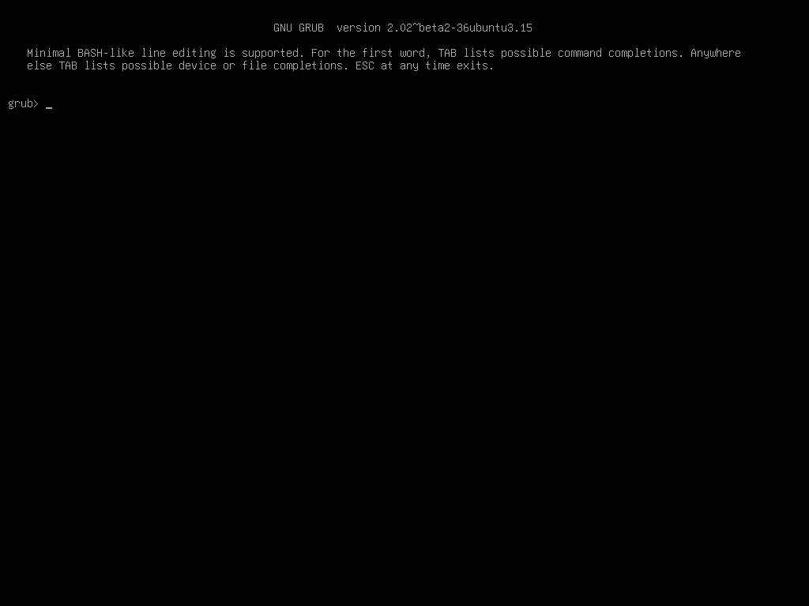

Linux 설치
==========

- [Linux 설치](#linux-%EC%84%A4%EC%B9%98)
    - [셋업 환경 구성](#%EC%85%8B%EC%97%85-%ED%99%98%EA%B2%BD-%EA%B5%AC%EC%84%B1)
        - [실제 하드웨어 vs 가상머신](#%EC%8B%A4%EC%A0%9C-%ED%95%98%EB%93%9C%EC%9B%A8%EC%96%B4-vs-%EA%B0%80%EC%83%81%EB%A8%B8%EC%8B%A0)
        - [Linux 배포판](#linux-%EB%B0%B0%ED%8F%AC%ED%8C%90)
    - [Linux 설치](#linux-%EC%84%A4%EC%B9%98)
        - [설치 미디어 준비](#%EC%84%A4%EC%B9%98-%EB%AF%B8%EB%94%94%EC%96%B4-%EC%A4%80%EB%B9%84)
        - [하드웨어 확인](#%ED%95%98%EB%93%9C%EC%9B%A8%EC%96%B4-%ED%99%95%EC%9D%B8)
        - [부트](#%EB%B6%80%ED%8A%B8)
        - [설치 전 설정](#%EC%84%A4%EC%B9%98-%EC%A0%84-%EC%84%A4%EC%A0%95)
        - [설치 진행](#%EC%84%A4%EC%B9%98-%EC%A7%84%ED%96%89)
        - [재부팅 이전에...](#%EC%9E%AC%EB%B6%80%ED%8C%85-%EC%9D%B4%EC%A0%84%EC%97%90)
        - [재부팅한 뒤 초기 설정](#%EC%9E%AC%EB%B6%80%ED%8C%85%ED%95%9C-%EB%92%A4-%EC%B4%88%EA%B8%B0-%EC%84%A4%EC%A0%95)
        - [nomodeset 기본값으로 주기 / 기본값에서 빼기](#nomodeset-%EA%B8%B0%EB%B3%B8%EA%B0%92%EC%9C%BC%EB%A1%9C-%EC%A3%BC%EA%B8%B0-%EA%B8%B0%EB%B3%B8%EA%B0%92%EC%97%90%EC%84%9C-%EB%B9%BC%EA%B8%B0)
        - [시스템 업데이트](#%EC%8B%9C%EC%8A%A4%ED%85%9C-%EC%97%85%EB%8D%B0%EC%9D%B4%ED%8A%B8)
    - [SSH 데몬 설치](#ssh-%EB%8D%B0%EB%AA%AC-%EC%84%A4%EC%B9%98)
        - [SSH Server public key fingerprint](#ssh-server-public-key-fingerprint)
    - [방화벽 설치](#%EB%B0%A9%ED%99%94%EB%B2%BD-%EC%84%A4%EC%B9%98)

-----

셋업 환경 구성
--------------

### 실제 하드웨어 vs 가상머신

- 리눅스 설치 연습이나 환경구성 테스트가 필요하면 VM을 사용한다.
- DNN 서버 셋업은 무조건 실제 하드웨어로 진행한다. VM은 그래픽 가속을 못 쓴다.
- VM을 사용하는 경우, VMware 라이센스에서 평가판은 학교에서 사용 못하는 점에 주의할 것.

### Linux 배포판

특별한 이유가 없다면 Ubuntu나 그 파생 배포판을 사용한다. 개인적인 추천은 Lubuntu.

**Ubuntu**

- Canonical에서 개발, 유지보수를 담당하고 있다.
- 현재 가장 쓰기 쉬운 배포판. 트러블슈팅 문서가 많아서 문제해결이 쉽다.
- Tensorflow도 Ubuntu 기준으로 개발 배포되므로, DNN 굴릴거면 우분투 쓰면 된다.
- 일반 버전은 출시이후 9개월간, LTS 버전은 5년간 보안 패치가 지원되므로, LTS 버전을 사용한다.

**RedHat, CentOS**

- RedHat 에서 개발, 유지보수를 담당하고 있다. CentOS는 RedHat의 오픈소스 클론이다.
- 개발 역사가 깊고 안정성을 많이 따지는 계열이라 웹서버 쪽에서 많이 사용한다.
- DNN 쓰기에는 글쎄요 수준. 소스코드 컴파일부터 시작해야 할 것이다.

**ArchLinux**

- Community 기반
- 롤링 업데이트 방식이라 패키지가 가장 빠르게 업데이트 된다.

-----

Linux 설치
----------

본 문서에서는 Lubuntu 16.04.3 LTS Destktop 기준으로 설치를 진행한다.
Ubuntu 및 그 파생 배포판도 설치과정은 거의 같다.

### 설치 미디어 준비

- ISO 이미지를 다운로드 받는다.
  - [Lubuntu 16.04 LTS Desktop x64](http://lubuntu.me/downloads/)
  - [Ubuntu 16.04 LTS Desktop x64](https://www.ubuntu.com/download/desktop) 
- [Rufus](https://rufus.akeo.ie/) 를 이용해서 설치 USB를 생성한다.
  - 
  - USB 생성을 누르면 Syslinux 버전이 맞지 않는다는 경고가 뜰 것이다.
    자동 다운로드를 진행한다.
  - 생성까지 시간이 몇 분 걸린다. 기다리셈
- 리눅스 설치할 PC에 ODD가 있다면 DVD에 구워서 설치해도 된다.

### 하드웨어 확인

- 최신 NVIDIA 그래픽카드를 사용한다면 nouveau 드라이버 이슈가 발생한다.
  이유는 모르겠지만 여하튼 커널패닉이 무더기로 쏟아지므로, 해당 드라이버를 끄고 설치해야 한다.
- 최신 메인보드는 UEFI 부팅을 지원한다. 이 경우 옵션이 약간 달라진다.

### 부트

- 설치 미디어를 꽂고 부팅한다.
- BIOS 부팅인 경우
  - 언어 선택 창이 뜨면 English를 선택한다. 한중일 언어는 응급복구 때 큰 곶통을 유발할 수 있다.
  - 
  - 메뉴가 뜨면 F6 누르고 nomodeset 옵션을 체크해서 nouveau 드라이버를 강제로 꺼 준다.
    그리고 Try LUbuntu 로 부트.
  - 
- UEFI 부팅인 경우
  - GRUB 부트메뉴가 뜨는데, 조금 덜 Fancy할 뿐 옵션은 BISO와 같다.
    Try Ubuntu 에 커서를 놓고 e를 누른다.
  - 
  - 부트옵션을 수동으로 입력할 수 있다.
    `linux ... quiet splash` 뒤에 `nomodeset` 을 추가해서 드라이버를 꺼 주고 F10 누르면 부팅된다.
  - 

### 설치 전 설정

- Lubuntu 데스크톱이 떴을 것이다. 고정 IP를 사용하는 환경이면 네트워크 설정을 진행한다.
- 여기에서 웹서핑이나 문서작업, 리눅스 응급복구가 가능하다.
- 

### 설치 진행

- 네트워크 되는걸 확인했다면 바탕화면의 Install Lubuntu를 실행한다.
- Welcome 에서는 언어를 설정하는데, 이번에도 영어로 설치한다.
- 업데이트 설치는 체크하고 서드파티 소프트웨어 설치는 선택사항이다.
  CUDA 설치할 때 그래픽카드 드라이버는 최신 버전이 같이 설치 될 것이다.
- 
- 파티션 설정이 나온다. 기존 OS와 듀얼부팅을 하겠다면 여기에서 적절히 만져준다.
  온전히 서버로 사용할 것이라면 그냥 다 지우고 자동으로 설정되게 해 준다.
- 
- 지역 설정은 Seoul,  키보드 설정은 Korean 101/104 Compatible을 쓰면 된다.
- 처음 사용자 설정이 나온다. 관리자 계정이 될 것이므로 잘 입력해 준다.
  특히 비밀번호는 가급적 길고 복잡하게 정하는게 좋다.
- 
- 이제 설치가 진행된다. 설치와 업데이트가 끝날때까지 기다린다. 대략 10분 정도 걸린다.
- 설치가 완료되면 지시에 따라 재부팅하기 이전에 다음 섹션을 읽어보고 준비한다.

### 재부팅 이전에...

- BIOS 설치인 경우, nomodeset 이 반영된 상태로 부트로더가 설치되므로 그냥 넘어가면 된다.
- UEFI 설치인 경우, nomodeset 이 반영되지 않은 상태로 부트로더가 설치된다.
  따라서 그냥 부팅하면 nouveau 호환성 문제로 커널패닉 메시지를 보게 될 것이다.
- 재부팅 한 뒤, 펌웨어 스플래시(메인보드 로고)와 Lubuntu 스플래시 사이에 잠깐동안
  아무것도 뜨지 않는 시간이 있다. 이 시간은 5초에서 10초 정도 되는데, 이 타이밍에
  ESC를 딱 한 번만 누르면 GRUB 부트메뉴를 볼 수 있다.
- Ubuntu 메뉴에 커서를 놓고 e 누르고 `quiet splash` 뒤에 `nomodeset` 추가한 뒤
  F10 눌러서 부팅한다.
- 
- 부트메뉴에서 ESC를 한 번 더 누르면 다음 이미지처럼 GRUB 콘솔로 빠져나간다.
  생각없이 ESC를 연타하는 경우 여기로 빠지기 쉬운데, 메뉴로 돌아갈 방법은 없다.
  그냥 reboot 실행해서 재부팅하고 적당한 타이밍을 노려야 한다. 리눅스가 다 이딴 식이다.
- 

### 재부팅한 뒤 초기 설정

- 부팅에 성공하면 로그인 스크린이 뜬다.
- 
- 그래픽 환경에서 진행해도 좋고, Ctrl+Alt+F1 눌러서 콘솔로 넘어가도 좋다. 여튼 로그인한다.
  이 문서에서는 Ctrl+Alt+F1 눌러서 콘솔에서 작업하도록 하겠다.
- 그래픽 환경에서 진행하는 경우, 바탕화면에서 Ctrl+Alt+T 를 눌러서 가상 콘솔을 띄운 후 작업한다.

### nomodeset 기본값으로 주기 / 기본값에서 빼기

```console
$ sudo nano /etc/default/grub
```

- `GRUB_CMDLINE_LINUX`을 찾는다. 아마 12번째 줄에 있을 것이다.
- UEFI 설치라면 해당 값이 빈 값("")으로 되어 있을 것인데, "nomodeset" 으로 바꿔준다.

```diff
- GRUB_CMDLINE_LINUX=""
+ GRUB_CMDLINE_LINUX="nomodeset"
```

- Ctrl+O 로 저장하고 Ctrl+X 로 nano를 종료한다.
- GRUB 설정을 업데이트 해 준다.

```console
$ sudo update-grub
Generating grub configuration file ...
Warning: Setting GRUB_TIMEOUT to a non-zero value when GRUB_HIDDEN_TIMEOUT is set is no longer supported.
Found linux image: /boot/vmlinuz-4.10.0-42-generic
Found initrd image: /boot/initrd.img-4.10.0-42-generic
Found linux image: /boot/vmlinuz-4.10.0-28-generic
Found initrd image: /boot/initrd.img-4.10.0-28-generic
done
```

- 이제 부팅할 때 `nomodeset` 을 수동으로 입력하지 않아도 된다.
- NVIDIA 드라이버를 제대로 설치한 뒤 `nomodeset` 옵션을 삭제한 뒤 GRUB 업데이트 하면 된다.

### 시스템 업데이트

- ~~업데이트 서버 기본값은 대전에 위치한 [KAIST 서버](https://launchpad.net/ubuntu/+mirror/ftp.kaist.ac.kr-ubuntu)
  이다. 그런데 관리상태가 좀 부실해서 가끔 접속이 안 되는 경우가 발생하므로,
  분당에 위치한 [Neowiz 서버](https://launchpad.net/ubuntu/+mirror/ftp.neowiz.com-archive)로
  변경한다. 이 작업은 한 번만 해 주면 된다.~~
- 2018년 초에 KAIST에서 서버 교체하면서 상태가 괜찮아졌으니 **이 단계는 생략**한다.

```console
$ # sudo sed -i 's/kr.archive.ubuntu.com/ftp.neowiz.com/g' /etc/apt/sources.list
```

- 시스템에 설치되어 있는 각종 패키지를 업데이트 한다

```console
$ sudo apt-get update
... blahblah ... many updates ...
Fetched 27.5 MB in 8s (3,340 kB/s)
Reading package lists... Done
$ sudo apt-get upgrade
... blahblah ... many package upgrades ...
Do you want to continue? [Y/n] y
... blahblah ... manu works ...
done.
```

**참고** 시스템 관리자는 apt-get update && apt-get upgrade를 정기적으로 해 주는 것이 좋다.
특히 보안 이슈로 패치가 배포되었다면 빼먹지 말고 패키지 업그레이드를 해 주자.

여기까지 작업하면 일반적인(Generic) 리눅스 설치작업은 완료된 것이다.
아래는 DNN 서버로 구성하기 위한 SSH 원격접속 설정 작업이다.

-----

SSH 데몬 설치
-------------

**참고** 데몬은 리눅스에서 백그라운드 프로세스를 말한다. 그냥 시스템 서비스라고 생각하면 된다.

**참고** SSH 데몬을 설치하면 원격에서 해당 서버에 접속할 수 있게 된다.
가능하다면 방화벽 및 암호 규칙 등 보안 정책을 적용하는 것이 좋다.

```console
$ sudo apt-get install ssh
... blahblah ...
The following NEW packages will be installed:
  ncurses-term openssh-server openssh-sftp-server ssh ssh-import-id
... blahblah ...
Do you want to continue? [Y/n] y
... blahblah ...
$ sudo nano /etc/ssh/sshd_config
```

- Port 22를 1만번 이상의 적절한 포트번호로 바꿔준다. 아마 5번째 줄에 있을 것이다.

```diff
- Port 22
+ Port 40022
```

- 다른 설정값은 기본값을 써도 된다. 더 빡센 보안설정을 원한다면 관련 문서를 찾아보자.
  예를들면 구글 인증기와 연동하여 SSH 접속시 6자리 OTP를 입력하게 할 수도 있다.
- Ctrl+O 로 저장하고 Ctrl+X 로 nano를 종료한다.
- 이제 SSH 데몬을 재시작한다.

```console
$ sudo systemctl restart sshd
```

### SSH Server public key fingerprint

SSH는 사용자 인증뿐만 아니라 서버 인증에도 Key-pair을 사용한다. 서버에도 인증서가 있는 것이다.
서버 인증키는 SSH 설치과정에서 자동으로 생성해 주므로 파악하기 어려울 뿐이다.

사용자로 하여금 내가 접속하는 서버가 진짜 그 서버가 맞는지 확인하도록 하는 것이 좋다.
PuTTY에서 서버에 최초 접속하는 경우, 공개키 지문값을 사용자에게 묻게 되므로 서버 무결성을
확인할 수 있는 것이다.


`/etc/ssh` 디렉터리 안에는 SSH 데몬이 사용하는 키파일이 여러 개 존재한다.
이 중 비밀키는 root만 확인할 수 있으며, 공개키(`.pub` 붙은 파일)는 아무나 확인할 수 있다.
각각의 공개키 파일에 대해 다음 과정을 수행하여 지문값을 확인하여 공지하면 된다.

```console
$ ssh-keygen -l -E md5 -f /etc/ssh/ssh_host_ed25519_key.pub
256 MD5:f9:95:41:d0:42:90:46:cc:f4:11:a0:26:fa:f3:91:5f root@DNN-server (ED25519)
```

-----

방화벽 설치
-----------

기본적으로 SSH는 IP주소와 포트번호만 알면 세계 어디에서나 접속이 가능하다.
이는 보안상 좀 문제가 되므로 (특히 중국때문에) 특정 IP대역에서만 접속가능하도록
방화벽을 설정한다.

리눅스에서 사용하는 `iptable` 방화벽은 매우 강력한 도구이지만, 설정이 매우 복잡하다.
따라서 이를 간략화시킨 `ufw` 프론트엔드를 사용할 것이다. 일단 설치한다.

- 사실 SSH 데몬 설치할 때 같이 설치된다.

```console
$ sudo apt-get install ufw
...
ufw is already the newest version (0.35-0ubuntu2).
...
$ sudo ufw enable
Firewall is active and enabled on system startup
```

- 이제 방화벽이 활성화되었다. 방화벽 설정은 변경하는 즉시 적용된다.
- 특정 IP대역을 SSH 포트번호에 대해서 열어준다.
  <IP>/<CIDR> 은 접속을 허용할 네트워크 대역이고, <SSH_PORT>는 위에서 변경한 SSH 포트번호이다.

```console
$ sudo ufw allow from <IP>/<CIDR> to any port <SSH_PORT>
Rule added
$ sudo ufw status verbose
Status: active
Logging: on (low)
Default: deny (incoming), allow (outgoing), disabled (routed)
New profiles: skip

To                         Action      From
--                         ------      ----
<SSH_PORT>                 ALLOW_IN    <IP>/<CIDR>
```

방화벽 설정이 잘못되면 원격접속이 원천 차단되므로 설정방법을 숙지해 두어야 한다.
ufw 사용법에 대해서는 대해서는 검색해 보도록 하자.
