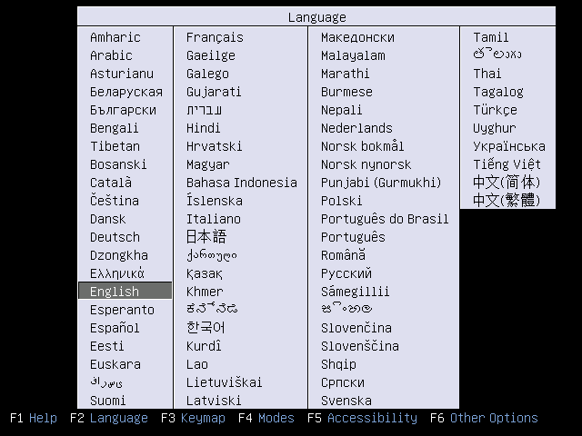
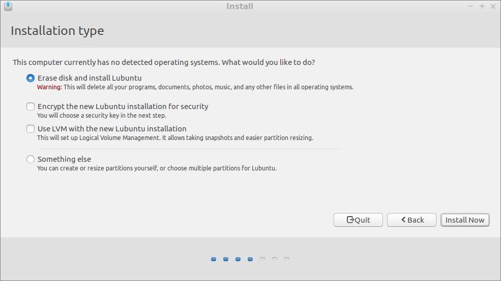

Linux Basics - Install Linux
============================

- [Linux Basics - Install Linux](#linux-basics---install-linux)
    - [What and Why Linux?](#what-and-why-linux)
    - [Before it begins,](#before-it-begins)
        - [Real machine vs Virtual machine](#real-machine-vs-virtual-machine)
        - [Distribution](#distribution)
    - [Prepare](#prepare)
        - [IF YOU USE REAL MACHINE,](#if-you-use-real-machine)
        - [Install Oracle VM VirtualBox](#install-oracle-vm-virtualbox)
        - [Create Virtual Machine and boot](#create-virtual-machine-and-boot)
    - [Install Linux](#install-linux)
    - [After Installation](#after-installation)
        - [Change Ubuntu Repository](#change-ubuntu-repository)
        - [Update Packages](#update-packages)
    - [Install SSH Daemon](#install-ssh-daemon)
    - [Apply Firewall](#apply-firewall)

What and Why Linux?
-------------------

Google will teach you.

Before it begins,
-----------------

### Real machine vs Virtual machine

- tl;dr 1 : Use real machine if possible; VM is usually test purpose in Lab env.
- tl;dr 2 : If you choose VM, prefer Oracle VM VirtualBox, which is GPLed.
  VMware Player is only available for personal use only.

**Real machine**
- require dedicated hardware, keyboard, mouse and monitor.
- has higher performance (linux uses whole hardware.)
- GPU is available; you can accelerate DNN using graphic hardware.
- when linux goes wrong, you need to re-install from scratch.
- You should prepare your own install media (DVD or USB).

**VM**
- easily create VM
- relatively lower performance (linux shares hardware with your host OS.)
- You cannot use GPU power in VM; DNN works using only CPU mode.
- you can take snapshot of VM; when something goes wrong, you can **revert**
  your VM to previous stable snapshot.
- be aware of VM software license; some VM softwares are NOT free!

### Distribution

- tl;dr 1 : Use Ubuntu and its derived distribution. They usually works, and
  are easy to trobuleshoot. I prefer Lubuntu because it is more lightweight.
- tl;dr 2 : Use LTS version if you have no reason of using latest one.

Prepare
---------------------

### IF YOU USE REAL MACHINE,

- [Download Ubuntu LTS Desktop x64](https://www.ubuntu.com/download/desktop) ISO.
  Alternatively, you can use [Lubuntu LTS Desktop x64](http://lubuntu.me/downloads/) ISO.
- Follow [Ubuntu Instruction](https://tutorials.ubuntu.com/tutorial/tutorial-create-a-usb-stick-on-windows)
  to create install USB.
- [OR] Burn ISO to DVD using any preferred burning software.
- Okay, you are now prepared. Proceed to **Install Linux** section.

### Install Oracle VM VirtualBox

### Create Virtual Machine and boot

Install Linux
-------------

Now Let's boot to install media.

After some initialization process (automated), you will see Welcome screen.
Select your language then press **Try Ubuntu**.

**NOTE** It is not recommended using CJK languages as your OS language, because
CJK cannot be shown correctly in text console mode, especially in recovery boot.
It will disturb your console works. Use English instead.

After refresh, you can see Ubuntu Desktop. You can try Ubuntu here.
Use Internet, wordprocessor and many other things. Even you can fix your broken
Linux installation in here.

I changed screen resolution. Let's start **Install Linux**. 

You will see welcome screen, but there is nothing lol.
Select your language then press **Continue**.

Check **Download updates**. Second one is your prefer. Press **Continue**.

Because this VM has no OS installed before, screenshot shows just one options only.
If previously installed OS exists, you may see some other options.

**WARNING** Your all data will be lost. Please backup them before proceed.

**INFO** If you want to install Ubunt side by your current OS, this document is
not applicable.

Select **Erase disk and install Ubuntu**, then press **Install Now**.
Installer will erase all data in your disk, re-create appropreate disk strcture,
then install Ubuntu automatically.

While installing, your system preference will be asked. Select PC's physical
location and Keyboard type.

Create user account. **username** and **password** are important. For security
reason, use long, powerful but easy-to-remember **password**.

For example, ``55th__harr-d-to-RemembeR-password`` might be a good case.

Your ubuntu is being installed now... Please wait... It takes not too long.

Install finished. Press **Restart Now**.

Now you can remove boot media (DVD or USB). Then press **ENTER** key.
For VM users, un-mount your ISO image.

After Installation
------------------

Ater reboot, you will see login screen. Use your **username** and **password**
to login. If you enabled **Autologin**, then this step is skipped.

Now you can see Ubuntu Desktop.

Press Ubuntu button, type **terminal** then press it.
Alternatively, you can open terminall by pressing **Ctrl+Alt+T**.

You opened graphic terminal.

### Change Ubuntu Repository

Because you selected Seoul as your PC's physical location, Ubuntu uses
[KAIST repository](https://launchpad.net/ubuntu/+mirror/ftp.kaist.ac.kr-ubuntu)
as update repository by default. Although KAIST provides good services, we will
switch to faster one,
[Neowiz repository](https://launchpad.net/ubuntu/+mirror/ftp.neowiz.com-archive).
Both of them are Ubuntu-official mirror repository, so don't worry about security.

Type following command in terminal:

`sudo sed -i 's/kr.archive.ubuntu.com/ftp.neowiz.com/g' /etc/apt/sources.list`

- `sudo` : `do` this command as `s`uper`u`ser priviledge.
- `sed` : call `s`tream `ed`itor
- `-i` : order sed to do `i`n-place replacement
  (edit input file itself; does not create new output file)
- `s/~~~/~~~/g` : how to replace
- `/etc/apt/sources.list` : apt update sources list file

### Update Packages

Type `sudo apt-get update` then press enter.

- `apt-get update` : call `a`dvanced `p`ackage `t`ool to `get` mode.
  `update` package list.

Because `sudo` is called, it askes your **password**. Type it correctly.
**Password** is never shown in display for security reason.

It downloads and updates package list. Now you can `upgrade` old packages to
new ones. Type `sudo apt-get upgrade` then press enter.

- `apt-get upgrade` : `upgrade` all available packages.

Because you used `sudo` command just before, it does not ask **password** again.
After some time (about 5 minutes), it will ask again.

There are many updates! Press Y then enter to continue upgrade.

Upgrade takes some time. After all, you get up-to-date ubuntu installation.

**NOTE** It is highly recommended to do `apt-get update` then `apt-get upgrade`
regularly. It includes security patches and software updates.

Install SSH Daemon
------------------

**NOTE** Daemon = System Service

**NOTE** SSHD enables remote access function. Consider general security concerns.

Open terminal then issue `apt-get install ssh` as superuser.

After install, change SSH port for security purpose.
Issue `nano /etc/ssh/sshd_config` as superuser.

- `nano` : call `nano` text editor
- `/etc/ssh/sshd_config` : file to edit

By default, Ubuntu provides well secured configuration file.
We need to change `Port 22` to some user-range ports (1024~65535).

In this example, the port number is changed to 40022.
Press `Ctrl+O` to write `O`ut configuration file, then press Enter.

Press `Ctrl+X` to e`X`it nano editor.
Then issue `systemctl restart sshd` as superuser to restart ssh daemon.

Apply Firewall
--------------

Because `iptables` is hard to use, we will use its frontend, `ufw`.
`ufw` stands for `u`ncomplicated `f`ire`w`all.
[Ubuntu's ufw document](https://help.ubuntu.com/community/UFW)

`ufw` is installed but disabled by default. Issue `ufw enable` as superuser.
Then check its status by issuing `ufw status verbose` as superuser.

Now firweall is enabled. All connection requests are denied by default.
hmm... It means that even **YOU** cannot connect to your server.

Now let's allow access to ssh daemon from our IP addresses.
In this document, we will use our Lab's default IP block. Check your IP address.

Issue `ufw allow from 165.132.124.0/22 to any port 40022` as superuser.

- `allow` : allow access,
- `from 165.132.124.0/22` : from 165.132.124.0 ~ 165.132.127.255 IP block.
  `/22` is [CIDR](https://en.wikipedia.org/wiki/Classless_Inter-Domain_Routing).
  To specify single IP address, just remove CIDR part.
  To specify any IP address , use `any`.
- `to any port 40022` : to any IP address of this server, with port number 40022.

Now check ufw status.

Okay, you allowed all IP address in range of 165.132.124.0 ~ 165.132.127.255
to connect to your server's 40022 port, which is binded to your SSH Daemon.
All other connections will be denied.

Repeat `ufw allow` command to add all PCs' IP addresses that you want to allow
connect. Firewall configuration is applied immediately, so don't need to restart
your firewall or reboot server.

Now you may logout, leave server console and do some stuffs on your PC.
