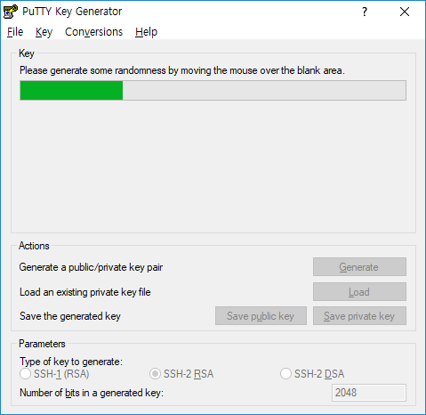
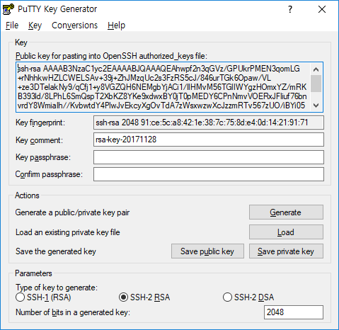
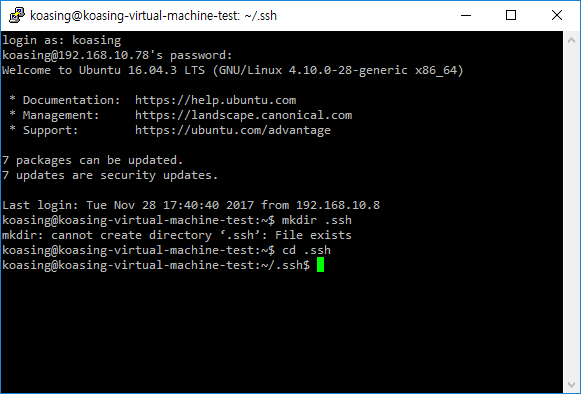
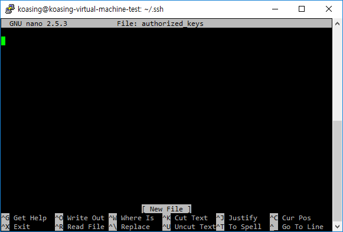
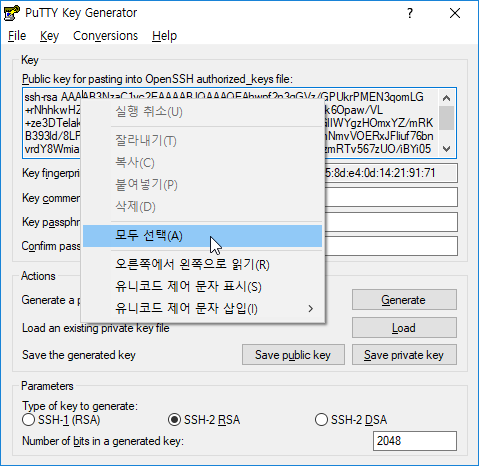
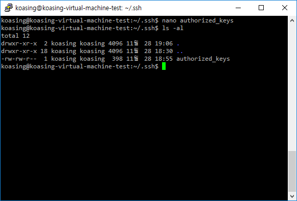
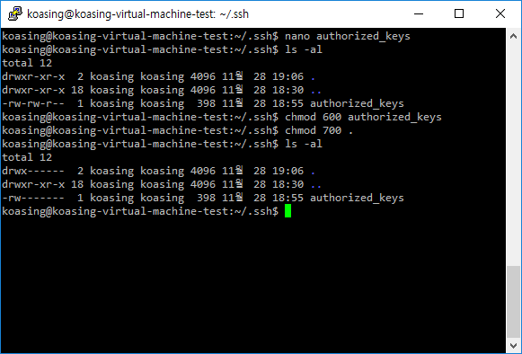
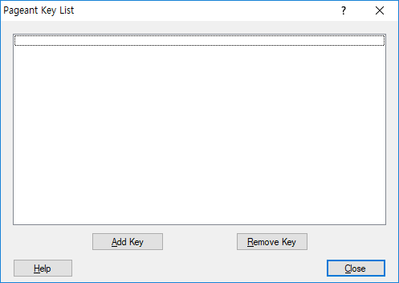

Setup SSH key-pair Login
========================

Assumption
----------

1. Ubuntu is installed and properly configured.
2. SSH Daemon is properly installed.
3. You have knowledge about basic console commands.

Install PuTTY
-------------

Basically, Windows have no default SSH client.

There are many SSH clients for windows, but
[PuTTY](https://www.chiark.greenend.org.uk/~sgtatham/putty/latest.html) is widely
used because of its small footprint. Alternatively, you may use
[MobaXterm](https://mobaxterm.mobatek.net/) or other tools.

Download **MSI('Windows Installer')** then install it. Usually default options
will work well.

Create SSH Key
--------------

Run `PuTTYgen`.

Check **Parameters**. SSH-2 RSA with 256 bits (which is default) will work good.
Then press **Generate** button. You will be asked to move mouse randomly over
the blank area.

After some works, a new key-pair is generated.

This key-pair will be used for SSH login credential. Set powerful but
easy-to-remember password to key itself, then save private and public keys.

Proceed to next section without closing PuTTYgen. If closed, re-run PuTTYgen,
then load private key using File - Load menu.

Set authorized_keys File
------------------------

Now let's opne SSH session to your server. Run `PuTTY`.

Input your server's IP addrss and SSH Daemon port number, then press **Open**.
Other options- usually default values works well.

A new black-and-white terminal will be opened. Use your **username** and
**password** to login.

If failed to connect, check server's IP address, SSH Daemon's port number, and
server's firewall settings.

This terminal works exactly same to Ubuntu's terminal window.

Make a `.ssh` directory by issuing `mkdir .ssh`.

- `mkdir` : `m`a`k`e `dir`ectory

(oops... I already have the directory. You may see no error message.)

Let's move into `.ssh` directory. Issue `cd .ssh`

- `cd` : `c`hange `d`irectory.

Now we will make and edit `authorized_keys` file. Issue `nano authorized_keys`.

Okay, switch to PuTTYgen, then select all public key text then copy it to PuTTY
session. By default, pressing right mouse button on PuTTY window will paste
clipboard contents.

Save `authorized_keys` file by pressing Ctrl+O, then exit `nano` by pressing
Ctrl+X.

Check directory's contexts by issuing `ls -al`.

- `ls` : `l`ist `s`egments. (Segment is one of Linux system internals.)
- `-al` : combined version of `-a` and `-l`.  
  `-a` stands for `all`, which orders to show all files including hidden ones.  
  `-l` stands for `long list`, which orders to show detailed informations.

Issue `chmod 600 authorized_keys` then `chmod 700 .` (do not omit last single
dot. it means current directory). It will prevent other users to access this
directory and files.

**NOTE** You may use `tab` key to do autocomplete filename.

You are now configured to use a key-pair to establish SSH connection.
Close PuTTYgen and PuTTY.

Use key-pair to connect SSH
---------------------------

Open `Pageant`. It basically residents in tray icon. Double-click it to open
key list.

Press **Add Key** to add your private key. Password is required to load key.

Press **Close** to close key list, then establish new PuTTY session.

You can see the difference? Yes, you didn't asked a password to login; instead,
public key is used to authenticate yourself.

You can use single key-pair to multiple servers, GitHub, Amazon Cloud and other
services, and single account can accept multiple public keys.

Remember: keep private key file in safe place, and always use strong key-file
password for security.
