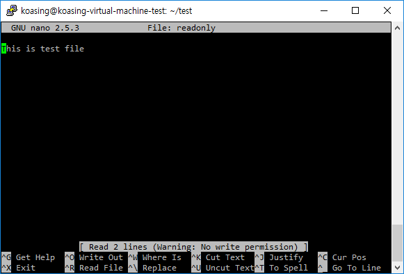
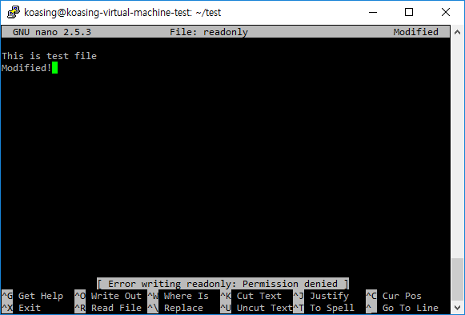
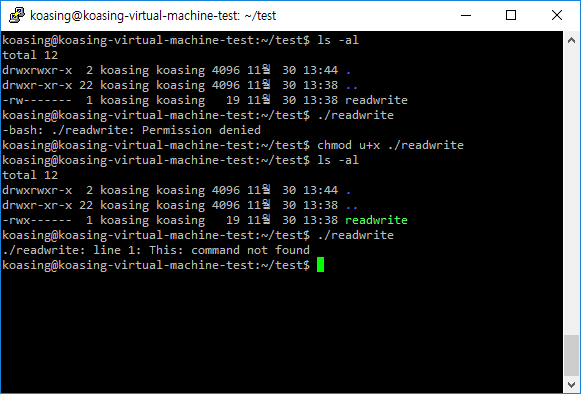

Permissions and Ownership
=========================

Linux has strict permission policy.

- [Permissions and Ownership](#permissions-and-ownership)
    - [Permissions](#permissions)
        - [what](#what)
        - [who](#who)
        - [Example](#example)
        - [If you are trying to access to...](#if-you-are-trying-to-access-to)
            - [NO read permission](#no-read-permission)
            - [NO write permission](#no-write-permission)
            - [NO execute permission](#no-execute-permission)
            - [all permission](#all-permission)
        - [If you are trying to access to...](#if-you-are-trying-to-access-to)
            - [NO read permission](#no-read-permission)
            - [NO write permission](#no-write-permission)
            - [NO execute permission](#no-execute-permission)
            - [NO write permission but have execute permission](#no-write-permission-but-have-execute-permission)
            - [all permissions](#all-permissions)
        - [DELETE file](#delete-file)
        - [CHDIR Permission](#chdir-permission)
    - [Change Permission](#change-permission)
        - [Symbolic mode](#symbolic-mode)
        - [Octal mode](#octal-mode)
    - [Usually...](#usually)

Permissions
-----------

Permission controls **who** can do **what** operation on that file.

### what

There are **THREE** types of operations for file.

- `R`EAD : the subject can **READ** that file's contents.
- `W`RITE : the subject can **MODIFY** that file's contents (WRITE onto it).
- E`X`ECUTE : the subject can **EXECUTE** that file.

For directory, the operation is somewhat different.

- `R`EAD : the subject can **READ file list** of that directory.
- `W`RITE : the subject can **MODIFY file list** of that directory.
- E`X`ECUTE : the subject can **CHANGE WORKING DIRECTORY** to that directory.

There are some special permissions additional to RWX, but you don't need to
know them for now.

### who

There are **THREE** references for each permission.

- Owner (`u`ser)
- `G`roup users
- `O`ther users

### Example

```console
$ ls -al
total 12
drwxr-xr-x  2 koasing koasing 4096 11월  28 19:06 .
drwxr-xr-x 18 koasing koasing 4096 11월  28 18:30 ..
-rw-rw-r--  2 koasing koasing  398 11월  28 18:55 authorized_keys
```

```
-rw-rw-r--  2 koasing koasing  398 11월  28 18:55 authorized_keys
----------    ------- ------- ---- -------------- ---------------
1234567890     owner   group  size   accesstime   filename
```

- (1) directory
- (2-4) owner's permission
- (5-7) group's permission
- (8-0) others' permission
- owner, group : file's ownership

### If you are trying to access to...

```console
$ ls -al
total 12
drwxrwxr-x  2 koasing koasing 4096 11월 30 13:38 .
drwxr-xr-x 22 koasing koasing 4096 11월 30 13:38 ..
----------  1 koasing koasing   19 11월 30 13:38 inaccessible
-r--------  1 koasing koasing   19 11월 30 13:38 readonly
-rw-------  1 koasing koasing   19 11월 30 13:38 readwrite
```

#### NO read permission

```console
$ nano inaccessible
```


Permission denied for reading.

#### NO write permission

```console
$ nano readonly
```



Read successful but cannot write.



Permission denied for writing.

#### NO execute permission


Permission denied for executing.

#### all permission



After adding user execute permission, the file is executed.
(Error is occured because the file is text document, not shell script.)

### If you are trying to access to...

```console
$ ls -al
total 24
drwxrwxr-x  6 koasing koasing 4096 11월 30 13:50 .
drwxr-xr-x 22 koasing koasing 4096 11월 30 13:38 ..
d---------  2 koasing koasing 4096 11월 30 13:50 inaccessible
dr--------  2 koasing koasing 4096 11월 30 13:50 readonly
drw-------  2 koasing koasing 4096 11월 30 13:50 readwrite
drwx------  2 koasing koasing 4096 11월 30 13:50 executable
dr-x------  2 koasing koasing 4096 11월 30 13:50 executable_readonly
```

#### NO read permission

```console
$ ls -al inaccessible
ls: cannot open directory 'inaccessible': Permission denied
```

cannot read file list

#### NO write permission

```console
$ ls -al readonly
ls: cannot access 'readonly/sample_file': Permission denied
ls: cannot access 'readonly/..': Permission denied
ls: cannot access 'readonly/.': Permission denied
total 0
d????????? ? ? ? ?             ? .
d????????? ? ? ? ?             ? ..
-????????? ? ? ? ?             ? sample_file
$ touch readonly/new_file
touch: cannot touch 'readonly/new_file': Permission denied
```

CAN read file list because the user have read permission, but cannot access
detailed information because the user have no execute permission.

cannot create a new file (= cannot insert new entry to directory file list).

#### NO execute permission

```console
$ ls -al readwrite
ls: cannot access 'readwrite/sample_file': Permission denied
ls: cannot access 'readwrite/..': Permission denied
ls: cannot access 'readwrite/.': Permission denied
total 0
d????????? ? ? ? ?             ? .
d????????? ? ? ? ?             ? ..
-????????? ? ? ? ?             ? sample_file
$ touch readwrite/new_file
touch: cannot touch 'readwrite/new_file': Permission denied
```

??? I have write permission but failed to modify directory... why?

because it is required to change directory into itself before modify it.

#### NO write permission but have execute permission

```console
$ ls -al executable_readonly
total 8
dr-x------ 2 koasing koasing 4096 11월 30 14:01 .
drwxrwxr-x 7 koasing koasing 4096 11월 30 13:59 ..
-rw-r--r-- 1 root    root       0 11월 30 14:01 sample_file
$ touch executable_readonly/new_file
touch: cannot touch 'executable_readonly/new_file': Permission denied
```

can read file list, and can access to detailed information.
Cannot create file because have no write permission.

#### all permissions

```console
$ ls -al executable
total 8
drwx------ 2 koasing koasing 4096 11월 30 13:50 .
drwxrwxr-x 7 koasing koasing 4096 11월 30 13:59 ..
$ touch executable/new_file
$ ls -al executable
total 8
drwx------ 2 koasing koasing 4096 11월 30 14:06 .
drwxrwxr-x 7 koasing koasing 4096 11월 30 13:59 ..
-rw-rw-r-- 1 koasing koasing    0 11월 30 14:06 new_file
```

can do all works

-----


### DELETE file

DELETE file is directory modification. Even you have no ownership of the file,
you CAN delete that file IF you have write permission on that directory.

```console
$ ls -al
total 8
drwx------ 2 koasing koasing 4096 11월 30 13:50 .
drwxrwxr-x 7 koasing koasing 4096 11월 30 13:59 ..
-r-------- 1 root    root       0 11월 30 13:59 roots_file
$ rm roots_file
rm: remove write-protected regular empty file `roots_file`? y
$ ls -al
total 8
drwx------ 2 koasing koasing 4096 11월 30 13:50 .
drwxrwxr-x 7 koasing koasing 4096 11월 30 13:59 ..
```

Vice versa, you CANNOT delete even a file that you own, if you have NO write
permission on that directory.

```console
$ ls -al
total 8
dr-x------ 2 koasing koasing 4096 11월 30 13:50 .
drwxrwxr-x 7 koasing koasing 4096 11월 30 13:59 ..
-rw-rw-r-- 7 koasing koasing    0 11월 30 13:59 my_file
$ rm my_file
rm: cannot remove 'my_file': Permission denied
```


### CHDIR Permission

Assume a situation that...

```
drwxr-xr-x ~/data
drw-r--r-- ~/data/wired
drwxr-xr-x ~/data/wired/my_data
```

Can I `cd` into `~/data/wired/my_data`? The answer is **no**, because one of its
ancestor has no permission to cd.


Change Permission
-----------------

`chmod` command controls file and directory permission. `chmod` stands for
`ch`ange `mod`e.

### Symbolic mode

`chmod [ref][op][modes] file ...`

- ref
    - u : user
    - g : group
    - o : others
    - can be combined: ug means user and group, uo means user and others, and
      so on...
    - a : all (same to ugo)
- op : operator
    - \+ : add this permission to ref
    - \- : remove this permission from ref
    - \= : set this permission to ref
- modes
    - r : read
    - w : write
    - x : execute
    - can be combined: rw means read and write, rx means read and execute, and
      so on...

### Octal mode

`chmod [octal] file ...`

The permission could be described as three octal number.

- READ = 4
- WRITE = 2
- EXECUTE = 1

For example...

- 600
    - 6 = 4 + 2 = READ + WRITE for owner
    - 0 = NO permission for group
    - 0 = NO permission for others
- 640
    - 6 = READ + WRITE for owner
    - 4 = READ for group
    - 0 = NO permission for others
- 755
    - 7 = 4 + 2 + 1 = READ + WRITE + EXEC for owner
    - 5 = 4 + 1 = READ + EXECUTE for group
    - 5 = READ + EXECUTE for others


Usually...
----------

Files
- 664 or 644 is default file permission.
- 600 is permission for sensitive file.
- 400, 440, 444 is read-only file.

Directory
- 755 is default directory permission
- 700 is permission for sensitive directory.
- 777 is public directory. **ANYONE CAN DELETE ANY FILE IN THAT DIRECTORY!!**
